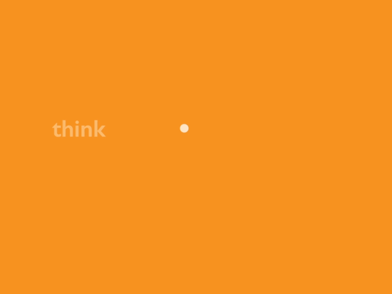

## Hi there!  
<!--
**thiagolopess/thiagolopess** is a ✨ _special_ ✨ repository because its `README.md` (this file) appears on your GitHub profile.
-->
  

- 👨‍💻 You can call me Thiago!
- 📒 I’m currently studying at [UnB](https://unb.br)
- 🌱 I’m currently learning about Software Architecture and Design and a lot more cool stuff!
- 💬 Ask me about anything!
- 📫 Reach me at: thiago.lopes.santos.tls@gmail.com
- 😄 Pronouns: he/him

 

<!--START_SECTION:waka-->
<!--END_SECTION:waka-->

